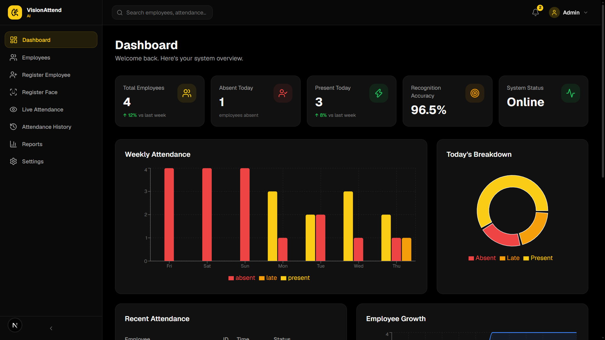
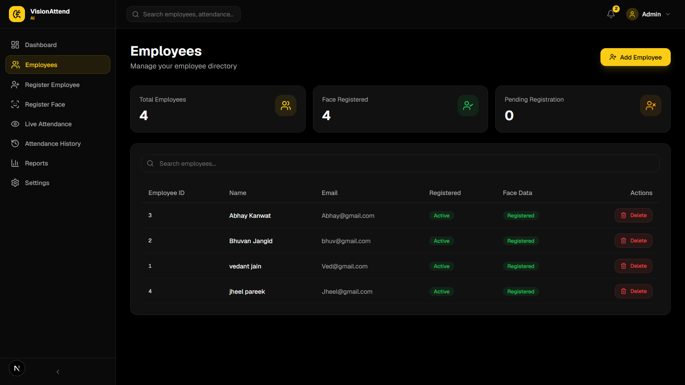
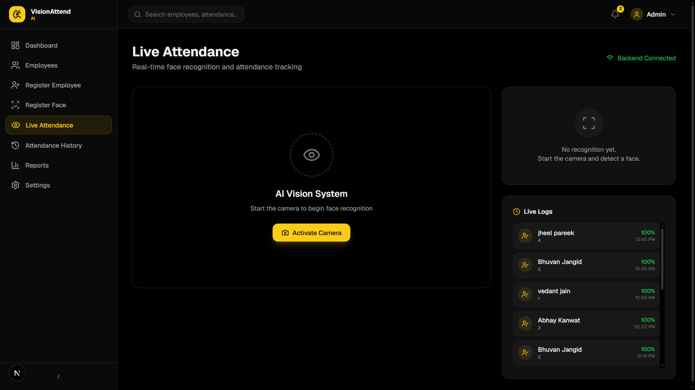
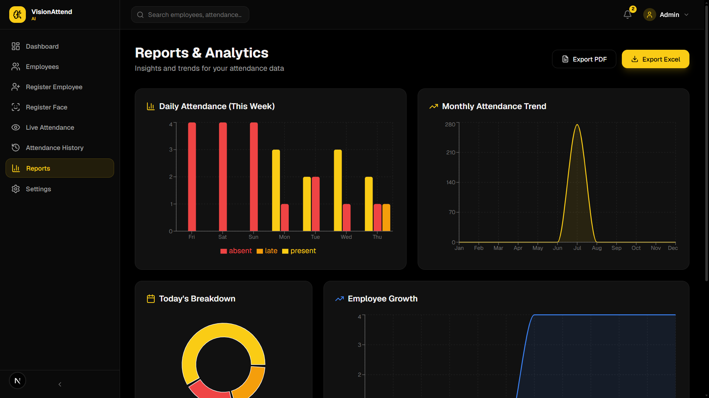

# 👁️ VisionAttend-AI

<div align="center">

AI Powered Face Recognition Attendance Management System built using **FastAPI**, **Next.js**, **InsightFace**, **OpenCV**, and **SQLAlchemy**.

Automatically recognize employees, mark attendance, monitor reports, and manage employees with a modern dashboard.


</div>

---

# ✨ Features

✅ AI Face Recognition using InsightFace

✅ Employee Registration

✅ Face Registration

✅ Real-Time Attendance

✅ Automatic Attendance Marking

✅ Late Attendance Detection (After 12 PM)

✅ Attendance History

✅ Weekly Attendance Reports

✅ Monthly Attendance Reports

✅ Employee Growth Analytics

✅ Dashboard Statistics

✅ Export Attendance CSV

✅ Responsive Modern UI

---

# 🛠 Tech Stack

### Frontend

- Next.js
- React
- TypeScript
- Tailwind CSS
- Framer Motion
- Axios
- Recharts

### Backend

- FastAPI
- SQLAlchemy
- Pydantic
- OpenCV
- InsightFace
- NumPy

### Database

- SQLite

---

# 📂 Project Structure

```
VisionAttend-AI
│
├── backend
│   ├── app
│   │   ├── api
│   │   ├── database
│   │   ├── models
│   │   ├── repositories
│   │   ├── services
│   │   ├── recognition
│   │   └── schemas
│   │
│   └── main.py
│
├── frontend
│   ├── app
│   ├── components
│   ├── hooks
│   ├── services
│   ├── lib
│   └── types
│
├── screenshots
│
└── README.md
```

---

# 🚀 Installation

## Clone Repository

```bash
git clone https://github.com/vedantjain-02/VisionAttend-AI.git

cd VisionAttend-AI
```

---

## Backend Setup

Create Virtual Environment

```bash
python -m venv .venv
```

Activate

Windows

```bash
.venv\Scripts\activate
```

Install Dependencies

```bash
pip install -r requirements.txt
```

Run Backend

```bash
uvicorn app.main:app --reload
```

Backend URL

```
http://127.0.0.1:8000
```

Swagger API

```
http://127.0.0.1:8000/docs
```

---

## Frontend Setup

```bash
cd frontend

npm install
```

Run

```bash
npm run dev
```

Frontend URL

```
http://localhost:3000
```

---

# 📸 Screenshots

## 🏠 Dashboard



---

## 👥 Employee Management



---

## 🎥 Live Attendance



---

## 📊 Reports Dashboard



---

# 🤖 Face Recognition Workflow

```
Camera
   │
   ▼
Capture Face
   │
   ▼
InsightFace Detection
   │
   ▼
Generate Face Embedding
   │
   ▼
Compare with Stored Embeddings
   │
   ▼
Recognized Employee
   │
   ▼
Attendance Marked
```

---

# 📊 Dashboard Modules

- Dashboard Overview
- Employee Management
- Live Attendance
- Attendance History
- Weekly Attendance Analytics
- Monthly Attendance Reports
- Employee Growth Reports
- System Health Monitoring

---

# ⏰ Attendance Rules

| Time | Status |
|------|--------|
| Before 12:00 PM | ✅ Present |
| After 12:00 PM | 🟡 Late |
| No Attendance | ❌ Absent |

---

# 📡 API Endpoints

## Employee APIs

| Method | Endpoint |
|---------|------------------------|
| GET | /users |
| POST | /users/register |
| DELETE | /users/{id} |
| POST | /users/{id}/face |

---

## Attendance APIs

| Method | Endpoint |
|---------|-------------------|
| GET | /attendance |
| GET | /attendance/today |
| POST | /attendance/live |

---

## Dashboard APIs

| Method | Endpoint |
|---------|-------------------------------|
| GET | /dashboard/stats |
| GET | /dashboard/today |
| GET | /dashboard/recent-attendance |
| GET | /dashboard/system-health |
| GET | /dashboard/weekly-attendance |
| GET | /dashboard/monthly-attendance |
| GET | /dashboard/employee-growth |

---

# 📈 Future Improvements

- Face Anti-Spoofing
- Leave Management
- Shift Management
- Role Based Authentication
- Multi Camera Support
- Email Notifications
- Docker Deployment
- PostgreSQL Support
- Cloud Deployment

---

# 📄 License

This project is licensed under the **MIT License**.

See the **LICENSE** file for more details.

---

# 👨‍💻 Author

**Vedant Jain**

GitHub:
https://github.com/vedantjain-02

---

<div align="center">

### ⭐ If you like this project, don't forget to Star the repository!

Made with ❤️ using FastAPI, Next.js & AI

</div>